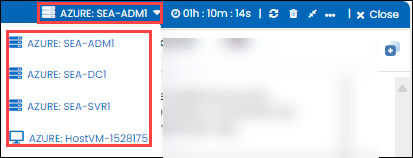
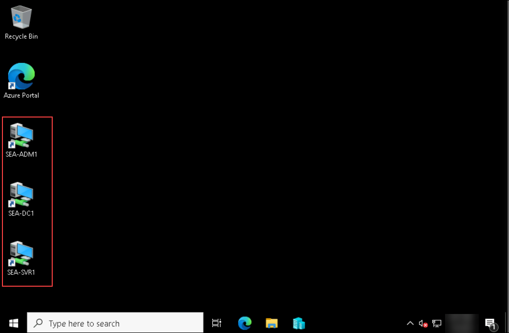
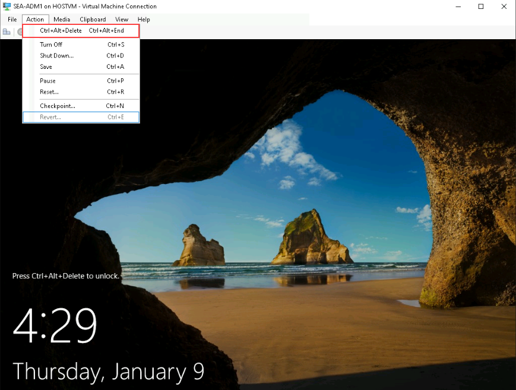
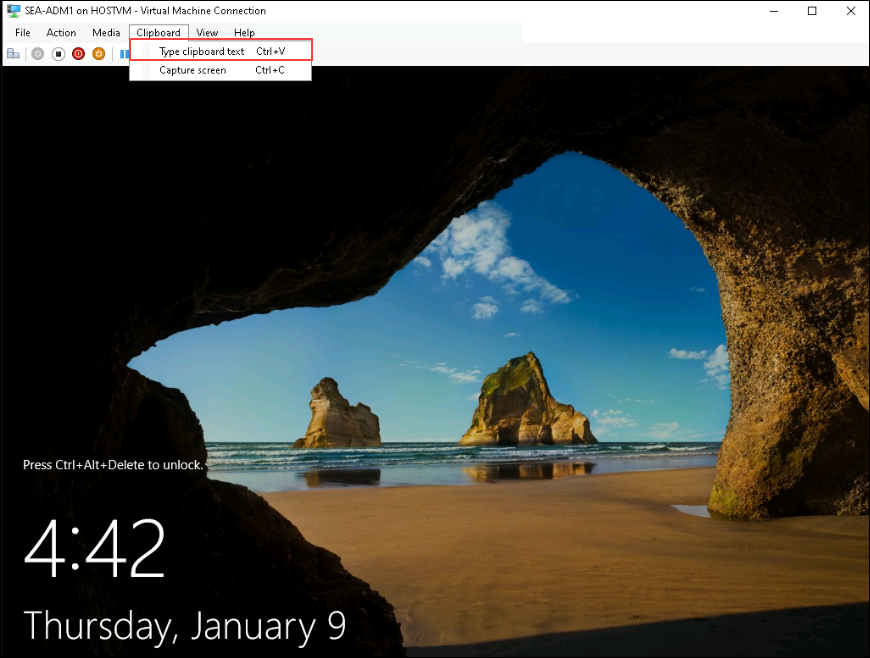

# Getting Started with Your AZ-800: Administering Windows Server Hybrid Core Infrastructure Workshop
 
Welcome to your AZ-800: Administering Windows Server Hybrid Core Infrastructure workshop! We've prepared a seamless environment for you to explore and learn about configuring and managing Windows Server on-premises, hybrid, and infrastructure as a service (IaaS) platform workloads. Let's begin by making the most of this experience:
 
## Accessing Your Lab Environment
 
Once you're ready to dive in, your virtual machine and lab guide will be right at your fingertips within your web browser.
 

### Virtual Machine & Lab Guide
 
Your virtual machine is your workhorse throughout the workshop. The lab guide is your roadmap to success.
 
## Exploring Your Lab Resources
 
To get a better understanding of your lab resources and credentials, navigate to the **Environment Details** tab.
 

 
## Utilizing the Split Window Feature
 
For convenience, you can open the lab guide in a separate window by selecting the **Split Window** button from the Top right corner.
 

 
## Managing Your Virtual Machine
 
1. Feel free to start, stop, or restart your virtual machine as needed from the **Resources** tab. Your experience is in your hands!
 
    

2. To Switch between the Virtual Machines, select the required VM from the dropdown.

    
    >**Note**: If the dropdown is not visible, you can manually select and launch the required VMs directly from the desktop of the HostVM.
    

3. When logging into the Hyper-V virtual machines, if a message appears stating **"Press Ctrl+Alt+Delete to unlock"**, navigate to the **Actions** menu in the Virtual Machine Connection window and select the **Ctrl+Alt+Delete** option, as shown in the image below.

    
    >**Note**: This step only applies if you are using Hyper-V virtual machines from the HostVM.

4. If you face an issue while copying the content from the lab guide and pasting it into the Hyper-V virtual machines, navigate to the **Clipboard** option in the Virtual Machine Connection window and select **Type Clipboard Text**.

    
    >**Note**: This step only applies if you are using Hyper-V virtual machines from the HostVM.

## **Lab Duration Extension**

1. To extend the duration of the lab, kindly click the **Hourglass** icon in the top right corner of the lab environment. 

    

    >**Note:** You will get the **Hourglass** icon when 10 minutes are remaining in the lab.

2. Click **OK** to extend your lab duration.
 
   

3. If you have not extended the duration prior to when the lab is about to end, a pop-up will appear, giving you the option to extend. Click  **OK** to proceed. 

## Workaround for Copying PowerShell Commands

If you encounter any difficulties with copy-pasting PowerShell commands directly, you can use the following workaround:

1. Open a text editor such as Notepad on your local machine.

2. Copy the PowerShell commands from the lab guide and paste them into the text editor.

3. Ensure that the formatting of the commands remains intact.

4. Copy the commands from the text editor and paste them into your virtual machine's terminal or PowerShell window.

By following this workaround, you can ensure accurate execution of the PowerShell commands in your lab environment.

## Let's Get Started with Azure Portal
 
1. On your virtual machine, click on the Azure Portal icon as shown below:
 
   .png)
    
3. You'll see the **Sign into Microsoft Azure** tab. Here, enter your credentials:
 
   - **Email/Username:** <inject key="AzureAdUserEmail"></inject>
 
      
 
3. Next, provide your password:
 
   - **Password:** <inject key="AzureAdUserPassword"></inject>
 
      

4. If **Action required** pop-up window appears, click on **Ask later**

    
       
5. If prompted to stay signed in, you can click "No."
 
6. If a **Welcome to Microsoft Azure** pop-up window appears, simply click "Maybe Later" to skip the tour.
 
7. Click "Next" from the bottom right corner to embark on your Lab journey!
 
    .png)
 
Now you're all set to explore the powerful world of technology. Feel free to reach out if you have any questions along the way. Enjoy your workshop!

>**NOTE:** If you encounter any issues where a webpage attempts to download instead of opening in your browser, then press and hold **Ctrl/Cmd** key on your keyboard, and **click the link**. This will force the page to open in a new tab and may resolve the issue of the page being downloaded.
